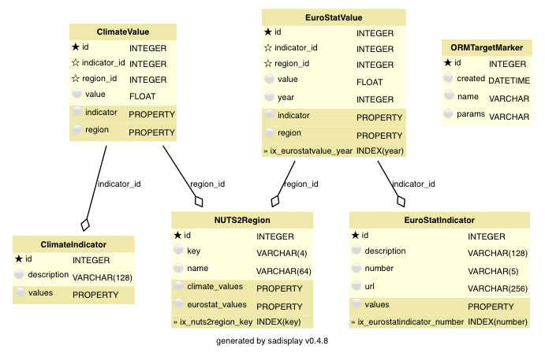

.. _em-datamodel:

Data model
**********

The project's data model, defined in ``models.py``, is shown in the diagram below.
Please see the :ref:`superheroes example <ht-model-diagram>` for details on how to create such a diagram.

We assume that you have read through the :ref:`data model section of the 'superheroes' example <sh-datamodel>`.
If you haven't, please do so now. In the following, we will only explain aspects
of the data model that go beyond those of the 'superheroes' example.

Metadata classes
================

.. py:currentmodule:: eurominder.models

The classes :class:`NUTS2Region`, :class:`EuroStatIndicator` and :class:`ClimateIndicator`
represent metadata of the NUTS2 regions, the different socioeconomic indicators and climate indicators,
respectively. They have no noteworthy features that go beyond what we have seen before.

Indicator values (time series and cascading)
============================================

.. py:currentmodule:: eurominder.models

The class :class:`EuroStatValue` represents one value of a socioeconomic indicator, for one
NUTS2 region and one year:

.. literalinclude:: ../ozelot-examples/eurominder/eurominder/models.py
    :pyobject: EuroStatValue

.. _ht-timeseries-model:

This demonstrates the canonic way of storing time series -- values for different time points are
stored in separate object instances, each carrying a time stamp (here the attribute :attr:`year`).

.. _ht-cascading:

Also, this class introduces relationships with 'cascading' behaviour: We would like all indicator
values to be deleted when the related indicator metadata or NUTS region metadata is deleted.
To this end, we to define a ``backref`` with cascading on the relationship.
We have to use a :class:`sqlalchemy.orm.backref` class instance instead of simply supplying a ``backref`` label
in order to configure the :attr:`cascade` parameter.

If cascading was defined on the relationship (not the backref), you would read it as
'delete the *pointed-to* object when the *current* object is deleted'. Since we want
the *current* object (the indicator value) to be deleted when the *pointed-to* object
(the metadata) is deleted, cascading is defined on the backref.
Cascading is a complicated topic, please refer to the `sqlalchemy documentation on cascades
<http://docs.sqlalchemy.org/en/latest/orm/cascades.html>`_ for more details.

.. note:: Cascading in SQLite requires explicit activation of foreign key support. The
          :class:`ozelot.client.Client` does this automatically.

The class :class:`ClimateValue` defines similar objects for storing climate data,
albeit not as a time series.

