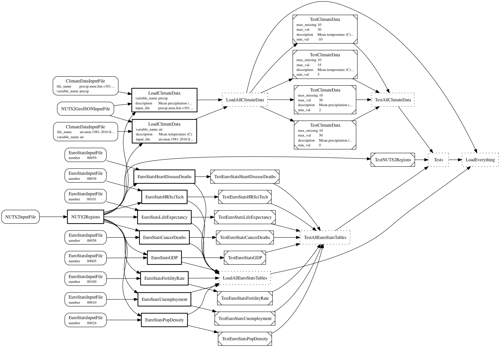

.. _em-pipeline:

ETL pipeline
************

The module :mod:`eurominder.pipeline` describes the ETL pipeline for our project.
The following diagram shows the pipeline. Please see the :ref:`superheroes example <superheroes-pipeline-diagram>`
for details on how to read (and create) this diagram. (Open the graph in a separate browser tab and zoom in, in
case you find it hard to read.)

.. _eurominder-pipeline-diagram:

.. _ht-pipeline-diagram-params:

In contrast to the 'superheroes' example, some tasks in the pipeline use :mod:`luigi` task parameters
to modify their behaviour. Instances of the same task class, but with different parameters, are shown
as separate nodes in the diagram. Nodes for those tasks list parameter names and values as tables.

We assume that you have read through the :ref:`pipeline section of the 'superheroes' example <sh-pipeline>`.
If you haven't, please do so now. In the following, we will only explain aspects
of the pipeline that go beyond those of the 'superheroes' example.

Reducing database interface code
================================

.. _ht-task-session:

.. py:currentmodule:: ozelot.etl.tasks

In the 'superheroes' example we managed the database connections explicitly: At the start
of a :func:`run` or :func:`clear` method we opened a database connection with something like:

.. code-block:: python

    session = client.get_client().create_session()

At the end of a method, changes were committed, the session closed and the task marked complete:

.. code-block:: python

        session.commit()
        session.close()
        self.mark_complete()

This pattern is very common. To avoid re-typing it for each task, :class:`ORMTask` has shortcuts:

* The property :attr:`ORMTask.client` provides a database client (for the default database connection).
  The connection is not opened on instantiation of the task, but only when the property is accessed for the first time.
* The property :attr:`ORMTask.session` provides a database session, using the client :attr:`ORMTask.client`.
  The session is not opened on instantiation of the task, but only when the property is accessed for the first time.
* :func:`ORMTask.close_session` commits any changes made within the session :attr:`ORMTask.session` and
  closes the session. If you want to close the session without committing, pass in the argument ``commit=False``.
  Use this method when you don't want to mark the task as complete, e.g. in the :func:`clear` method of a task.
* :func:`ORMTask.done` calls :func:`ORMTask.close_session` and additionally marks the task as complete.
  Use this method at the end of the :func:`run` method of a task.

Using these features, you don't have to write any code to open a database connection
at the beginning of a task function, simply use ``self.client`` and ``self.session`` of the task instance.

.. note:: Don't forget to close the session at the end of a task function, using :func:`ORMTask.close_session`
          or :func:`ORMTask.done`. For some database adapters, like :mod:`psycopg2` for PostgreSQL, there is
          a limited pool of sessions available. If you open sessions (e.g. by acessing the :attr:`session` property
          of a task) but forget to close them, you may run out of connections and get errors.

NUTS region metadata (and standard, slow object creation)
=========================================================

.. py:currentmodule:: eurominder.pipeline

Loading the NUTS region metadata, in particular region codes and the associated names,
is standard fare: :class:`NUTS2InputFile` represents the input file, including a simple
loading routine; :class:`NUTS2Regions` creates one :class:`eurominder.models.NUTS2Region` instance
per region and adds it to the database; :class:`TestNUTS2Regions` performs simple consistency checks
on the import.

.. _ht-slow-add:

So far this is nothing new, but let's recap how objects are created and added to the database:

.. literalinclude:: ../../../examples/eurominder/eurominder/pipeline.py
            :start-after: -- start documentation include: standard-object-add
            :end-before: -- end documentation include: standard-object-add
            :dedent: 8

This is the standard way of committing objects, which we have used so far.
When adding objects this way, :mod:`sqlalchemy` does a lot of work in the background,
including type checking, generation of primary keys, generation of multiple entries
for polymorphic objects, etc. However, all this comes at the cost of performance. When
adding hundreds of thousands of entries or more, this can become excrutiatingly slow.
Below, you will see two other methods of committing data: using :mod:`sqlalchemy`
bulk saving and directly writing SQL tables. These are much faster but come
at the cost of reduced convenience. Read on for details.

EuroStats data (with subclassed tasks and SQL table writing)
============================================================

Input files
-----------

.. py:currentmodule:: eurominder.pipeline

The input files for all EuroStats data tables are represented by :class:`EuroStatsInputFile`.
This is the first example of a task taking a :mod:`luigi` pameter: :attr:`number`, the identifying number of
the table. More on task parameters below.

The format of the different data tables varies slightly. All have a first column listing metadata,
including the NUTS2 region code, as comma-separated string. The other columns are values per year.
The variation comes in some tables listing values per sex (male, female and total) while others don't,
and some tables giving values for single years while others report three-year averages.
The :func:`EuroStatsInputFile.load` method takes arguments ``key_filter`` and ``header_preproc``
to enable extracting 'total' values only and managing year ranges in column headers.
The method always returns a :class:`pandas.DataFrame` with a column ``key``, listing the NUTS2 code,
and the other columns yearly values, with the year number as the column name.

.. _ht-subclassing-tasks:

Avoiding code duplication by subclassing tasks
----------------------------------------------

Loading of the different EuroStats tables differs only slightly: each task loads a different file
(identified by a table number), uses a different indicator description and sometimes needs
additional filters for loading the data. For programmers it should be obvious to write
the loading code just once, instead of duplicating it for each table loader.
Here, this is achieved with a base class :class:`LoadEuroStatsTableBase` that has
class-level attributes :attr:`number`, :attr:`description`, :attr:`key_filter` and :attr:`header_preproc`.
For each table we implement a derived class that defines the values for these attributes,
for example :class:`EuroStatsGDP`.
:ref:`See below <em-eurostat-wrapper>` for a list of derived tasks.

.. note:: Using :class:`luigi` parameters instead of subclassing would be an equally valid, if not better, choice
          here, as we don't actually use features of inheritance like method overloading.
          We use subclassing for demonstration purposes.

You may find it obvious to not duplicate common functionality.
We are stressing that point because many GUI-based data integration tools make it hard for you to do so,
and Excel certainly does. The possibility to 'not repeat yourself' is one of the strong points
in favor of a script-based data integration solution.

.. _ht-write-sql:

Storing data quickly by writing SQL tables
------------------------------------------

We handle our data via an ORM layer. However, the data are stored as SQL tables in the underlying database,
with one table per ORM object class. If we want to quickly store large amounts of data to the database, we can
directly write to the SQL tables, instead of adding objects via the ORM. If we do that, we need to take care
to follow the table structure as defined by the ORM, with one column per data field (including any fields
defined in the base class, like ``id``).

Doing that, we lose some convenient features of the :mod:`sqlalchemy` ORM. For example, we need to generate object
IDs ourselves, there are no auto-incrementing primary keys. Also, if we were to use polymorphic objects, we would
need to write to several tables. This is demonstrated in :func:`LoadEuroStatsTableBase.run`
and explained in the following.

.. _ht-sequences-and-bulk:

.. warning:: Auto-incrementing primary keys are implemented using 'sequences' is most databases, for example
             in PostgreSQL. These sequences are *not* used and updated when writing objects as SQL tables or
             doing bulk saving (see below). In this case, your sequence gets out of sync with the object IDs.
             If you were to add an object afterwards by adding it to a session and committing it,
             you would get a 'duplicate key' error. There are ways to update sequences after bulk saving, but
             this is not (yet) implemented in :mod:`ozelot`.

Before we load any indicator values, we first create a new metadata instance for this indicator.
This is done the 'old fashioned' way:

.. literalinclude:: ../../../examples/eurominder/eurominder/pipeline.py
    :start-after: -- start documentation include: eurostats-run-1
    :end-before: -- end documentation include: eurostats-run-1
    :dedent: 8

The next step is to load the table data and start reshaping it. In the end, we want a :class:`pandas.DataFrame`
with columns ``value``, ``year``, ``region_id``, ``indicator_id`` and ``id``, to match the table structure
of the :class:`eurominder.models.EuroStatValue` class. After the following operations, we have
``value`` and ``year`` columns, and a colum ``key`` containing the NUTS2 region keys.

.. literalinclude:: ../../../examples/eurominder/eurominder/pipeline.py
    :start-after: -- start documentation include: eurostats-run-2
    :end-before: -- end documentation include: eurostats-run-2
    :dedent: 8

As mentioned above, we need to generate the primaray keys 'manually'. To this end, we
add an ``id`` column:

.. literalinclude:: ../../../examples/eurominder/eurominder/pipeline.py
    :start-after: -- start documentation include: eurostats-run-3
    :end-before: -- end documentation include: eurostats-run-3
    :dedent: 8

Finally we add a column for the indicator ID (the reference to the metadata object generated above), and one
linking the values to NUTS2 regions. For the latter, we retrieve the mapping from region keys to
region object IDs from the database. The final step to get our table in the right format is to drop the
column ``key``, which is not part of the object attributes:

.. literalinclude:: ../../../examples/eurominder/eurominder/pipeline.py
    :start-after: -- start documentation include: eurostats-run-4
    :end-before: -- end documentation include: eurostats-run-4
    :dedent: 8

Now we can save to the SQL table that holds the values of
:class:`eurominder.models.EuroStatValue`. Note that we 'append' to the existing table
instead of replacing it: this way, we would get an error message if our table structure didn't match
that of the ORM-generated table. Finally, we call :func:`done` to close the database session and mark the task
as complete.

.. literalinclude:: ../../../examples/eurominder/eurominder/pipeline.py
    :start-after: -- start documentation include: eurostats-run-5
    :end-before: -- end documentation include: eurostats-run-5
    :dedent: 8

.. _ht-delete-cascade:

Deleting by cascading relationships
-----------------------------------

In :func:`LoadEuroStatsTableBase.clear` we see one more, useful feature: In the data model
we defined a `backref with cascading <ht-cascading>`_. This comes in handy for clearing the
indicator metadata and values for one input table: Deleting the indicator deletes all associated
values, because of the defined cascading behaviour.

.. literalinclude:: ../../../examples/eurominder/eurominder/pipeline.py
    :pyobject: LoadEuroStatsTableBase.clear
    :dedent: 4

.. _em-eurostat-wrapper:

Consistency checks and wrapper tasks
------------------------------------

All table loader tasks are wrapped in the task :class:`LoadAllEuroStatsTables`:

.. literalinclude:: ../../../examples/eurominder/eurominder/pipeline.py
    :pyobject: LoadAllEuroStatsTables

For each loader task, there is a task checking data consistency. All test tasks
are derived from a base class :class:`TestEuroStatsTableBase`, which checks value ranges and
missing values. As for the loader tasks,
the derived test tasks define class attributes like the expected min/max range of values
and the allowed number of missing values, for example :class:`TestEuroStatsGDP`.
All test tasks are wrapped in :class:`TestAllEuroStatsTables`:

.. literalinclude:: ../../../examples/eurominder/eurominder/pipeline.py
    :pyobject: TestAllEuroStatsTables

Climate data (with task parameters and bulk saving)
===================================================

.. _ht-task-parameters:

Avoiding code duplication by using task parameters
--------------------------------------------------

Parameter basics
++++++++++++++++

:ref:`Above <ht-subclassing-tasks>` we saw an example of how to implement common funcitonality for multiple
tasks by sub-classing a base task class. An alternative, and often easier, pattern is to use :mod:`luigi`
task parameters.

Task parameters are defined as class-level variables. They are instances of :class:`luigi.Parameter` (for
string parameters) or one of its derived classes, like :class:`luigi.IntParameter`, :class:`luigi.FloatParameter`,
:class:`luigi.BoolParameter` etc.

Parameter values are passed into the task constructor as named arguments.
A parameter can be defined as having a default value. If no default value is given, :mod:`luigi` will throw
an exception if no parameter value is defined when instantiating the task.

Task instances of the same class, but with different parameters, are considered 'different tasks' by :mod:`luigi`.
In other words, if a task has completed with one set of parameters, a task of the same class but with different
parameters will run separately.

Loading climate data
++++++++++++++++++++

.. py:currentmodule:: eurominder.pipeline

We load two different sets of climate data: surface air temperature and precipitation.
The input files are represented by the same task :class:`ClimateDataInputFile`, using :mod:`luigi` parameters to define
the climate variable name and the input file name:

.. literalinclude:: ../../../examples/eurominder/eurominder/pipeline.py
    :start-after: -- start documentation include: climate-input-params
    :end-before: -- end documentation include: climate-input-params
    :dedent: 4

Data is loaded by :class:`LoadClimateData`, which similarly takes parametes for the climate variable name
and input file, and additionally for a description of the climate variable:

.. literalinclude:: ../../../examples/eurominder/eurominder/pipeline.py
        :start-after: -- start documentation include: climate-load-params
        :end-before: -- end documentation include: climate-load-params
        :dedent: 4

Its :func:`requires` method shows how to use parameter values (simply access the class level variables)
and how to instantiate tasks with parameters (simply pass the values into the constructor).
Here, an input file task with the same variable name and input file name as the loader task is
set as requirement:

.. literalinclude:: ../../../examples/eurominder/eurominder/pipeline.py
    :pyobject: LoadClimateData.requires

An excursion into geodata processing
------------------------------------

Our next task in importing climate data is to take each (rasterized) map and
average its values over each NUTS2 region. For each region, we know its enclosing
polygon in GeoJSON format.

netCDF input files
++++++++++++++++++

.. py:currentmodule:: eurominder.pipeline

The input data is provided in 'netCDF' format. This is a common format in climate sciences,
which is little used elsewhere. :mod:`scipy.io` provides tools for reading and writing
netCDF files. Check out :func:`ClimateDataInputFile.load` for an example of how to read
a netCDF file. After opening the file, the different 'variables' are exposed as a dictionary
of numpy arrays. Besides the actual climate data (a 3D array with dimensions time, lat an lon), it
contains indices of the lat/lon coordinates and some metadata. We extract the relevant data and
do some other preprocessing, like shifting Europe to the middle of the map.

Later, we need to draw polygons in the same coordinate system as the map. The polygons nodes are given
as lat/lon coordinates. To draw them, we need to translate these coordinates to indices in the map array.
To this end, we build two interpolation functions that take lat (or lon) values and convert them to indices

.. literalinclude:: ../../../examples/eurominder/eurominder/pipeline.py
        :start-after: -- start documentation include: climate-input-interp
        :end-before: -- end documentation include: climate-input-interp
        :dedent: 8

Drawing GeoJSON polygons
++++++++++++++++++++++++

To get the average value for a NUTS2 region, we create a rasterized mask of its surface area
and average the climate data across the mask. The mask is generated using :mod:`matplotlib`:
we draw the polygon into an image and extract the image content as a mask.
This is done in :func:`geojson_polygon_to_mask` (make sure to check out the full code).

Setting up :mod:`matplotlib` for this task means defining a plot without any border or margin
and with the right aspect ratio:

.. literalinclude:: ../../../examples/eurominder/eurominder/pipeline.py
        :start-after: -- start documentation include: poly-setup
        :end-before: -- end documentation include: poly-setup
        :dedent: 4

After we have drawn the polygon, we can extract the image contents as a :mod:`numpy` array:

.. literalinclude:: ../../../examples/eurominder/eurominder/pipeline.py
            :start-after: -- start documentation include: poly-extract
            :end-before: -- end documentation include: poly-extract
            :dedent: 4

Inbetween these two operations we, of course, have to draw the polygon.
See the documented code in :func:`geojson_polygon_to_mask` for how to do this.
We draw into the same array shape as those of the climate data maps, and we use the
interpolation functions defined above to translate lat/lon coordinates to indices.
Also, in a crude approximation to partial averaging around the polygon edges, we draw the polygons in grayscale
using antialiasing. (This is not very accurate.)

Two aspects about GeoJSON polygons are worth pointing out: (1) A polygon may consist of multiple
strings of nodes. If so, the first one defines the enclosing boundary and the other ones
define 'holes' on the inside (which need to be drawn with the background color of the plot).
(2) There are also 'MultiPolygons', which conist of several polygons (which may, in turn, have holes).

.. _ht-bulk-save:

Storing data quickly by bulk saving
-----------------------------------

