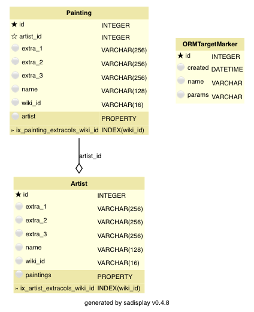

.. _le-extracols:

Extra columns
*************

Setup
=====

The next model/pipeline version uses 'extra columns'. To try it out, set ``MODE = 'extracols'`` and
``EXTENDED = False`` in ``project_config.py``.

Data model
----------

.. py:currentmodule:: leonardo.extracols.models

This data model stores only the :attr:`wiki_id` and :attr:`name` as 'base data' for each
:class:`Artist` and :class:`Painting`. All other data is offloaded to 'extra columns'.
As we don't know yet what these columns will contain, data must be stored as strings.
You can probably already imagine that this is not a very elegant solution.

Pipeline
--------

.. py:currentmodule:: leonardo.extracols.pipeline

The ingestion pipeline structure is exactly the same as in the :ref:`standard version <le-standard>`.
The code for loading the data into the DB differs a bit, since we have to change attribute names
and cast all values in extra columns to string. For example, loading the paintings looks like this:

.. literalinclude:: ../../../examples/leonardo/leonardo/extracols/pipeline.py
    :pyobject: LoadPaintings

Similarly, the test tasks :class:`TestArtists` and :class:`TestPaintings` need to cast
the values from the extra columns back to their correct data types before testing value ranges.

Queries and Analysis
--------------------

.. py:currentmodule:: leonardo.extracols.queries

When querying, you need, again, to remember which extra column contains which attribute, and cast data
types back to numeric, for example:

.. literalinclude:: ../../../examples/leonardo/leonardo/extracols/queries.py
    :pyobject: decade_query

The above query includes a little surprise: Filtering for ``extra_1 < 5``, which is supposed to filter on
surface area less than 5 square meters, doesn't give you the expected result!
:attr:`extra_1` is a string, so "15" is less than "5".
A correct query, e.g. filtering only after casting back to numeric, is left as an excercise to the reader.

Changing the model
==================

Not changing the model
----------------------

.. py:currentmodule:: leonardo.extracols.models

Good news (finally): the data model doesn't change when switching to ``EXTENDED = True``.
We have enough extra columns left in :class:`Artist` to accommodate the additional attributes.
The task :class:`leonardo.extracols.pipeline.LoadArtists`
simply includes the additional data when loading and stores them in :attr:`Artist.extra_1`
and :attr:`Artist.extra_2`.

Manual data loading
-------------------

Still, for the same reasons as in the :ref:`standard version <le-standard-loading>`,
re-running just the loading task for the artists is not easily done.
One-off code for adding the additional attributes might be the only choice.

Summary
=======

The version with extra columns avoids schema changes, as long as there are enough columns left.
You pay for that bit of convenience with everlasting confusion about which column stores which value;
with casting to string and back with all its associated headaches;
and with giving up on useful database functionality like filters.
The number of cases in which this is the optimum solution is probably very small.
