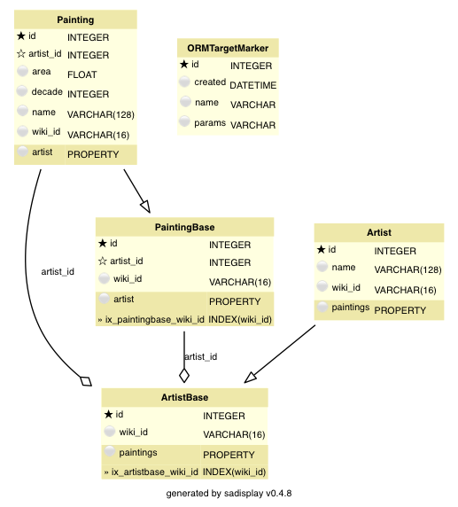
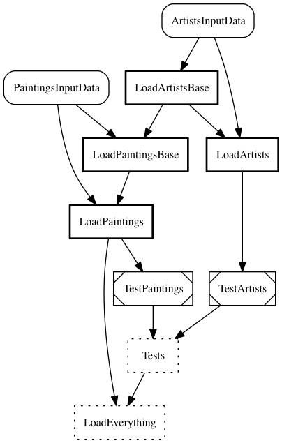

.. _le-inheritance:

Inheritance
***********

Setup
=====

This model/pipeline version uses class inheritance. To try it out, set ``MODE = 'inheritance'`` and
``EXTENDED = False`` in ``project_config.py``.

.. _le-model-inheritance:

Data model
----------

.. py:currentmodule:: leonardo.inheritance.models

This version of the data model looks a bit different from the :ref:`standard version <le-standard-model>`.
Both :class:`Artist` and :class:`Painting` are derived from a base class,
:class:`ArtistBase` and :class:`PaintingBase`, respectively.
The base class only stores the :attr:`wiki_id` and, in the case of :class:`PaintingBase`, the foreign-key reference
to the respective :class:`ArtistBase`.

Such a data model lets us separate object attributes from base entities.
This helps when changing the model, as demonstrated :ref:`below <le-inheritance-change>`.
In the present example, this may look like overhead (and for such a simple setup it probably is).
However, inheritance can be a useful way of managing data models in multi-tenant solutions or similar situations:
Imaging you have five customers for your solution. Between them, data models have 90% overlap but each needs
10% customized attributes. You don't want to expose all custom attributes to all customers, but you also don't want
to implement and maintain the overlap five times.
Using a custom base class with extended inherited classes for each customer can be a viable solution in this case.

In code, this model is implemented by regular class inheritance.
Note the custom :attr:`id` column in :class:`Artist` linking to the base instance:

.. literalinclude:: ../../../examples/leonardo/leonardo/inheritance/models.py
    :pyobject: ArtistBase

.. literalinclude:: ../../../examples/leonardo/leonardo/inheritance/models.py
    :pyobject: Artist

:mod:`sqlalchemy` has very useful functionality for such a data model.
Attributes of the base class are available in the derived classes, both in Python and for queries.
By default, :mod:`sqlalchemy` uses 'joined table inheritance': base and derived classes
map to separate tables that are joined automatically in queries. This means that,
if you query a derived object, :mod:`sqlalchemy` automatically joins in the respective base class table.
Corresponding object instances of the base and derived class carry the same :attr:`id`.
When creating and committing object instances via ``session.add(...)``, adding a derived instance
automatically also adds a base instance, with matching keys.

Inheritance is often used with a 'polymorphic discriminator column' - a column in the base class that is automatically
filled with a value describing which derived class the entity belongs to.
For more details, please refer to the
:mod:`sqlalchemy` `documentation <http://docs.sqlalchemy.org/en/latest/orm/inheritance.html>`_.

.. _le-inheritance-pipeline:

Pipeline
--------

.. py:currentmodule:: leonardo.inheritance.pipeline

In the pipeline we have separated creating the base objects from creating the derived objects carrying most
of the attributes. When creating the derived objects, we use the :attr:`wiki_id` to make sure that
corresponding base and derived instances carry the same :attr:`id`.
(This could be simplified by using the :attr:`wiki_id` as primary key instead of an integer :attr:`id`.)

.. literalinclude:: ../../../examples/leonardo/leonardo/inheritance/pipeline.py
    :pyobject: LoadArtistsBase

.. literalinclude:: ../../../examples/leonardo/leonardo/inheritance/pipeline.py
    :pyobject: LoadArtists

A corresponding approach is used in :class:`LoadPaintingsBase` and :class:`LoadPaintings`.

As mentioned above, if we created :class:`Artist` as regular object instances and stored them via
``session.add(...)``, :mod:`sqlalchemy` would take care of creating a base class instance.
Here, with base and derived object generation separated, we need to create both instances ourselves.

Queries and Analysis
--------------------

.. py:currentmodule:: leonardo.inheritance.queries

Thanks to :mod:`sqlalchemy`'s help in using data models with inheritance, the queries look exactly
the same as in the :ref:`standard version <le-standard-queries>`. That's nice!

.. _le-inheritance-change:

Changing the model
==================

Drop, create
------------

.. py:currentmodule:: leonardo.inheritance.models

Let's set ``EXTENDED = True`` and try to load the additional attributes.
The additional attributes will be stored in :class:`Artist`.
Our :class:`Painting` (more precisely, :mod:`PaintingBase`) objects don't store foreign-key references
to :class:`Artist` but to :class:`ArtistBase`, so we can simply drop and re-create the :class:`Artist`
table with the new schema:

.. code-block:: python

    from ozelot import client
    from leonardo.inheritance import models
    cl = client.get_client()
    models.Artist().drop_table(cl)
    models.Artist().create_table(cl)

Pipeline loading
----------------

.. py:currentmodule:: leonardo.inheritance.pipeline

In our pipeline, we separated generation of the base object instances from loading of attributes.
No task in the pipeline depends on :class:`LoadArtists` (only the analysis does), so we can
simply clear and re-run that task to load the additional attributes:

.. code-block:: python

    import luigi
    from leonardo.inheritance import pipeline
    pipeline.LoadArtists().clear()
    luigi.build([pipeline.LoadArtists()], local_scheduler=True)

Summary
=======

Model inheritance can be a very useful feature to make your data models more flexible,
and :mod:`sqlalchemy` is a great help for implementing and using it.
In a simple case, such as the present example, the advantage of being able to add attributes to a model
may not warrant the additional complexity.
In real-life situations, however, the added flexibility for evolving or multi-tenant solutions may well be
worth the effort.
