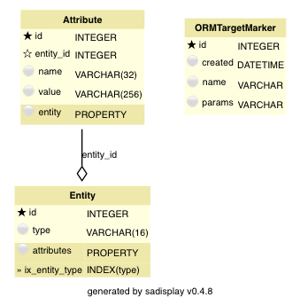

.. _le-kvstore:

Entity-attribute-value model
****************************

This version of the model/pipeline uses a very flexible (and unconstrained) data model:
instead of defining specific object classes with their attributes, there is only a generic
'entity' class. Generic 'attributes' store data about these entities.
This model is refered to as an
`entity-attribute-value model <https://en.wikipedia.org/wiki/Entity%E2%80%93attribute%E2%80%93value_model>`_, or,
more generally, as key-value store.

The model implemented here is relatively simple. Of course, it is possible to implement a much more elaborate
setup for storing and querying data, managing types and casting, data validation etc.
The basic features of the model, however, stay roughly the same.

To use this version, set ``MODE = 'kvstore'`` and ``EXTENDED = False`` in ``project_config.py``.

Setup
=====

Data model
----------

.. py:currentmodule:: leonardo.kvstore.models

Any type of object instance is stored as an :class:`Entity` in this model.
Different entities have different values of :attr:`Entity.type`, like 'artist' or 'painting' in this example.
More elaborate versions of this model may link to a separate class carrying metadata about entity types.

Similarly, any entity attribute is stored as a :class:`Attribute`, which links to the :class:`Entity` instance
it belongs to. Different types of attributes are identified by their :class:`Attribute.name`, e.g. 'wiki_id'
or 'area' for painting attributes. As the type of data carried by the attribute varies, it has to be stored
as string :attr:`Attribute.value`.
Again, more elaborate versions of this model may link to an object carrying attribute metadata.

Pipeline
--------

.. py:currentmodule:: leonardo.kvstore.pipeline

The pipeline structure looks like in the :ref:`standard pipeline <le-standard-pipeline>`.
The tasks :class:`LoadArtists` and :class:`LoadPaintings` themselves also look relatively simple,
because storage of data tables is offloaded to a mixin class :class:`EntityCreatorMixin`.
(Reminder: click the class name, then '[source]' in the header to see the code.)
In its :func:`store` method, rows of a data table are stored as separate entities, and
columns are stored as separate attributes:

.. literalinclude:: ../../../examples/leonardo/leonardo/kvstore/pipeline.py
    :pyobject: EntityCreatorMixin.store

Queries
-------

.. py:currentmodule:: leonardo.kvstore.pipeline

Loading entities with all their associated attributes is implemented in
:func:`leonardo.kvstore.models.Entity.query_with_attributes`:

.. literalinclude:: ../../../examples/leonardo/leonardo/kvstore/models.py
    :pyobject: Entity.query_with_attributes

With this, queries for all objects of a type with all associated attributes are simple.
However, any filtering has to happen afterwards, as well as casting attribute values back
to their correct types. For example, the query for painting surface area and decade looks like this:

.. literalinclude:: ../../../examples/leonardo/leonardo/kvstore/queries.py
    :pyobject: decade_query

Similar casting operations also have to be done in the test tasks
:class:`TestArtists` and :class:`TestPaintings`.

Changing the model
==================

No schema change needed
-----------------------

.. py:currentmodule:: leonardo.kvstore.pipeline

Adding new attributes to the database doesn't require any schema change.
You simply create more :class:`Attribute` entities with the desired data.

Manual data loading
-------------------

As implemented here, you would need to write one-off code to only load the additional attributes,
if you don't want to clear all data and re-run the pipeline.
You could separate entity and attribute loading as in the :ref:`inheritance version <le-inheritance>`, so that
additional attributes could be loaded separately.

Summary
=======

The entity-attribute-value model offers extreme flexibility, but at a high price.
You loose most of the benefits of an ORM: there is no clearly defined and documented data model on the
object level; joining has to be done manually; you need lots of type casting; filtering on the DB-level
is difficult; interaction with front-ends like Business Intelligence tools, which could easily talk
to a regular database model, is very difficult.

If you want that type of flexibility, you are probably better off just using
a `document-oriented database <https://en.wikipedia.org/wiki/Document-oriented_database>`_.

