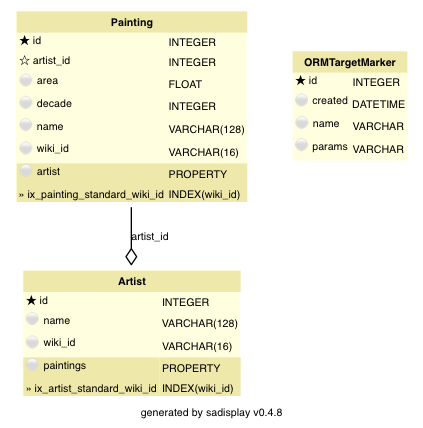
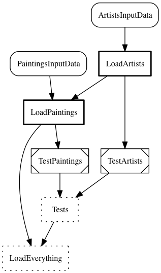

.. _le-standard:

Standard version
****************

.. _le-standard-model:

Setup
=====

Data model
----------

.. py:currentmodule:: leonardo.standard.models

Our data model in this example consists of two object types, paintings and artists, each modeled
by its own ORM class. In our 'standard' way of doing things, both are pretty straightforward.
The :class:`Artist` model stores the unique wikipedia object ID :attr:`wiki_id` and name
of the artist.
In the :ref:`extended version <le-modes>`, it additionally stores gender and date of birth.

.. literalinclude:: ../../../examples/leonardo/leonardo/standard/models.py
    :pyobject: Artist

The :class:`Painting` is similarly straightforward and should be self-descriptive.
Note the foreign-key relationship linking a :class:`Painting` to an :class:`Artist`;
this is going to cause headaches when working with data model changes.

.. literalinclude:: ../../../examples/leonardo/leonardo/standard/models.py
    :pyobject: Painting

Pipeline
--------

.. py:currentmodule:: leonardo.standard.models

The ingestion pipeline is pretty straightforward: First, artists are stored in the DB via
:class:`LoadArtists`, then paintings in :class:`LoadPaintings`.
These tasks mainly load the input tables from :class:`leonardo.common.ArtistsInputData` and
:class:`leonardo.common.PaintingsInputData`,
re-format them suitably and store them directly as SQL tables.

In :func:`LoadPaintings.run`, note how paintings are linked to artists by looking up the respective
artists objects via their wiki ID and storing the respective object IDs in :attr:`artist_id`:

.. literalinclude:: ../../../examples/leonardo/leonardo/standard/pipeline.py
    :pyobject: LoadPaintings.run

On the ingested data, consistency checks are run in :class:`TestArtists` and :class:`TestPaintings`.
Additionally, there are two wrapper tasks :class:`Tests` and :class:`LoadEverything` for management purposes.

Queries and Analysis
--------------------

.. py:currentmodule:: leonardo.standard.queries

Out 'analysis' consists of generating two graphs, correlating painting size with the decade and with
the artist's gender. The latter is only generated with the extended model/pipeline version.
The plots are rendered as SVG images into a :mod:`jinja2` HTML template, resulting in
`a single html file <../../_static/leonardo/analysis.html>`_ containing the analysis.

Plotting and HTML generation are the same between all model/pipeline version.
They are contained in :mod:`leonardo.common.analysis`.
The queries needed for retrieving the required data differ between the versions.
For the standard version, they are, well, standard fare:
One query retrieves painting surface area and decade, limiting the selection to
the years 1600-2000 and excluding extremely large painting with more than 5 square meters surface area:

.. literalinclude:: ../../../examples/leonardo/leonardo/standard/queries.py
    :pyobject: decade_query

The second query similarly filters the paintings and retrieves area and artist gender:

.. literalinclude:: ../../../examples/leonardo/leonardo/standard/queries.py
    :pyobject: gender_query

Changing the model
==================

The nuclear option
------------------

.. py:currentmodule:: leonardo.standard.models

Let's assume that you have run your whole pipeline with the base model (``EXTENDED = False``), i.e. with
:class:`Artist` *not* containing the :attr:`Artist.gender` and :attr:`Artist.year_of_birth` attributes.
Now you want those attributes included and set ``EXTENDED = True`` in ``project_config.py``.
How do you get that change into your data model and load the respective data?

The simplest, and most radical, way is the 'nuclear option': delete all data, re-initialize your data
model, re-run the whole pipeline (and analysis):

.. code-block:: none

    python manage.py initdb
    python manage.py ingest
    python manage.py analze

However, you might not want to do that, for example because your pipeline computes for a very long time,
because some process uses parts of the database, or for other reasons.

Trouble with foreign keys
-------------------------

.. py:currentmodule:: leonardo.standard.models

The model change only affects the :class:`Artist`, so why not drop that table and re-create it with the new schema?
In a Python shell, do the following (after setting ``EXTENDED = True``):

.. code-block:: python

    from ozelot import client
    from leonardo.standard import models
    cl = client.get_client()
    models.Artist().drop_table(cl)

.. code-block:: none

    [...]
      File "/[...]/python2.7/site-packages/sqlalchemy/engine/default.py", line 470, in do_execute
        cursor.execute(statement, parameters)
    IntegrityError: (sqlite3.IntegrityError) FOREIGN KEY constraint failed [SQL: u'\nDROP TABLE artist_standard']

Oops! We cannot drop the :class:`Artist` table because the :class:`Painting` objects keep foreign-key
references to it!

Manual table extension
----------------------

What we can do is manually extend the table. If using an SQLite database,
you could open an SQLite command shell

.. code-block:: none

    sqlite3 leonardo.db

and issue two commands to append the desired columns:

.. code-block:: none

    ALTER TABLE Artist ADD COLUMN gender VARCHAR(16);
    ALTER TABLE Artist ADD COLUMN year_of_birth INTEGER;

There are also ways to do this in :mod:`sqlalchemy`, if you want to use Python or if
you want to stay independent of the database backend.

Now that you have the desired fields in the database, you need to ingest the additional data.
Simply running ``python manage.py ingest`` does nothing, because the tasks are all marked as complete:

.. code-block:: none

    ===== Luigi Execution Summary =====

    Scheduled 1 tasks of which:
    * 1 present dependencies were encountered:
        - 1 LoadEverything()

    Did not run any tasks
    This progress looks :) because there were no failed tasks or missing external dependencies

    ===== Luigi Execution Summary =====

Clearing and re-running just the task :func:`leonardo.standard.pipeline.LoadArtists` is nasty, because
each :class:`Painting` keeps a foreign-key reference to an :class:`Artist`, by its database-internal ID,
and you might not be guaranteed to recreate the :class:`Artist` objects in exactly the same order.
One way around that would be to change the foreign-key relationship and join via the unique
identifier :attr:`wiki_id` of the artist. Since we are not doing that here, we would
need to write one-off code to load the artist input data and attach the
gender and year of birth to existing objects in the database, using the :attr:`wiki_id` to correctly assign them.

Clearing :func:`LoadArtists` and all its dependencies is also an option, but this amounts to re-running
the whole pipeline, which is just what we are trying to avoid.

Summary
=======

In the 'standard' version of our model, we cannot easily drop and re-create tables that are pointed to
by foreign-key references. Besides the nuclear option, manual schema editing and one-off data loading is often
the only option.

