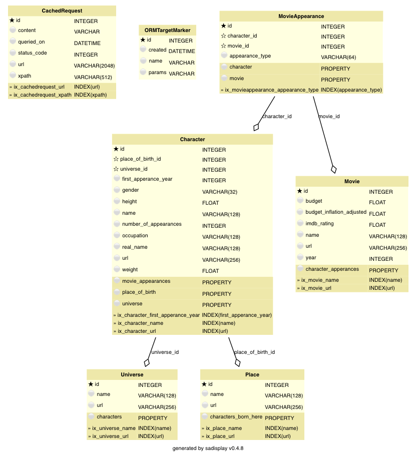

.. _sh-datamodel:

Data model
**********

The project's data model, defined in ``models.py``, is a typical example of a relatively simple
data model with several related objects.

.. _ht-model-diagram:

This is a diagram of the data model we are building.

The rendering functionality is included in :func:`ozelot.orm.base.render_diagram`.
Rendering a diagram of your models is as easy as importing all relevant models
and issuing a single call:

.. code-block:: python

    import models
    from ozelot.orm import base
    base.render_diagram("/some/output/path/and_base_name")

Note that this requires `GraphViz <http://www.graphviz.org/>`_ to be installed and the
path to the ``dot`` executable to be defined in your ``project_config.py`` variable
:attr:`DOT_EXECUTABLE`. (GraphViz is available as an easy-to-install conda package.)

The diagram above was created by issuing (see also the section :ref:`running`):

.. code-block:: none

    python manage.py diagrams

.. _ht-orm-basics:

'Universe' (and ORM model basics)
=================================

The simplest object class is the :class:`superheroes.models.Universe`. It describes one
'universe' or 'continuity' within the
`Marvel multiverse <https://en.wikipedia.org/wiki/Multiverse_(Marvel_Comics)>`_.

.. literalinclude:: ../../../examples/superheroes/superheroes/models.py
    :pyobject: Universe

The class defines to fields, a :attr:`name` and an :attr:`url`.
Both strings are marked to be indexed in the database, enabling quick searches.
Also, they have maximum column lengths defined (128 and 256 characters, respectively).

A maximum column lenght is useful for safety reasons, for example, to avoid inadvertently adding extremely large
strings to a database.
Note that the maximum length is not enforced when using an SQLite database.
For databases enforcing it (e.g. PostgreSQL), trying to insert a value longer than the allowed maximum
will cause an error.

The class is derived from :class:`ozelot.models.base.Base`, inheriting
a pre-defined primary integer key :attr:`id`, a pre-defined table name and other useful functionality
defined in :class:`ozelot.models.base.ExtendedBase`.

The pattern shown here is the standard way of defining ORM model classes in :mod:`sqlalchemy`:
ORM model classes are derived from an instance of :class:`sqlalchemy.ext.declarative.declarative_base`.
The base class functionality can be extended as is done in :mod:`ozelot.models.base`:

.. code-block:: python

    Base = declarative_base(cls=ExtendedBase)

For further details see the excellent :mod:`sqlalchemy`
`ORM tutorial <http://docs.sqlalchemy.org/en/latest/orm/tutorial.html>`_.

.. _ht-basic-field-validation:

'Place' (and field validation)
==============================

The next object class, :class:`superheroes.models.Place`, describes a place or location.
It is used to represent the place of birth of a superhero.
The class is very similar to the Universe, with one exception:

.. literalinclude:: ../../../examples/superheroes/superheroes/models.py
    :pyobject: Place

The exception is the method :meth:`superheroes.models.Place.truncate`, decorated with
:meth:`sqlalchemy.orm.validates`. For the fields listed in the :meth:`validates` argument,
the function is called to validate and clean field values before inserting values into a
database. Here, we call :meth:`ozelot.models.base.ExtendedBase.truncate_to_field_length` for
the field :attr:`name`, which truncates any value for :attr:`name` to the maximum allowed
column length before inserting a value.

More details and exapmles on validators can be found in the
:mod:`sqlalchemy` `documentation <http://docs.sqlalchemy.org/en/latest/orm/mapped_attributes.html#simple-validators>`_.

.. _ht-object-relationships:

'Character' (and object relationships)
======================================

The class :class:`superheroes.models.Character` holds most data about a superhero.
It introduces the important concept of object relationships:

.. literalinclude:: ../../../examples/superheroes/superheroes/models.py
    :pyobject: Character

You will recognize the definition of string columns and the string length validation from previous models.
Float and integer columns should be self-explanatory.

What is new and exciting are object relationships:
The relationship :attr:`universe` links a :class:`Character` to the :class:`Universe`
it belongs to, identified by the foreign key field :attr:`universe_id`.
This is a typical examples of how to define a one-to-many relationship.
The universe is the 'one' side, the character the 'many' side.
In other words, each character is associated
with only one universe, while a universe may have many associated characters.

The relationship is defined by a :class:`ForeignKey` field, which holds a reference to a primary key
of the related object, here :attr:`Universe.id` or :attr:`Place.id`.
The special :class:`sqlalchemy.orm.relationship` attribute
enables easy queries on related objects. After retrieving a character ``hero`` from the database, details
about its universe can simply be accessed directly:

.. code-block:: python

    >>> print hero.name
    'Captain Crunch'
    >>> print hero.universe.name
    'Earth-616'

If necessary, :mod:`sqlalchemy` automatically runs additional SQL queries to retrieve data for related objects.
This is demonstrated in more detail in :ref:`queries`.
For an in-depth treatment of relationships see the
`sqlalchemy documentation <http://docs.sqlalchemy.org/en/latest/orm/relationships.html>`_.

A similar relationship is defined for the place of birth:
:attr:`place_of_birth` is a relationship to a :class:`Place` object, with the associated
foreign key field :attr:`place_of_birth_id`.

'Movie' (and nothing new)
=========================

The :class:`superheroes.models.Movie` class does not introduce any new data modeling features,
so relax and recap what you already know.

.. literalinclude:: ../../../examples/superheroes/superheroes/models.py
    :pyobject: Movie

.. _ht-many-to-many:

'MovieAppearance' (and many-to-many relationships)
==================================================

The final class, :class:`superheroes.models.MovieAppearance`, demonstrates how to define many-to-many
relationship patterns.

.. literalinclude:: ../../../examples/superheroes/superheroes/models.py
    :pyobject: MovieAppearance

The relationship pattern demonstrated in :class:`superheroes.models.Character` allows defining one-to-many,
many-to-one or `one-to-one <http://docs.sqlalchemy.org/en/latest/orm/basic_relationships.html#one-to-one>`_
relationships. Here, we want to model the appearances of characters in movies. Since a character can appear
in many movies, and a movie has many characters, we need to define in many-to-many relationship.
We do this using a so-called 'association object', see the
`sqlalchemy documentation <http://docs.sqlalchemy.org/en/latest/orm/basic_relationships.html#many-to-many>`_
for alternatives.

A :class:`MovieAppearance` stores the appearance of one character in one movie,
by referencing the respective character and movie as related objects.
To query all characters appearing in one movie, one would query all :class:`MovieAppearance` instances
associated with the movie, and then all referenced characters.
See :ref:`queries` for an example.

The association object can carry additional information about the relationship.
Here, we store in :attr:`appearance_type` the type of appearance (main character, supporting, ...).

.. _ht-initializing-db:

Building the database tables
============================

Each ORM object class maps to one database table.
Our base class extension :class:`ozelot.models.base.ExtendedBase` pre-defines the table name for each
class as the lower-cased class name.

The table structure of a class is given by the class attributes.
Therefore, :mod:`sqlalchemy` can automatically build the table structure for you.
In :class:`superheroes.models` you find a handy utility function to do this:

.. literalinclude:: ../../../examples/superheroes/superheroes/models.py
    :pyobject: reinitialize

This function drops all tables associated with ORM objects and then re-creates them.
Note that, in order for tables to be created, the respective ORM object classes have to be imported
or defined in the same file. This is why the class :class:`ozelot.models.target.ORMTargetMarker`,
which we need for task tracking in the ETL pipeline, is imported here.

.. warning:: Calling :func:`reinitialize` will delete all data contained in the respective tables.

