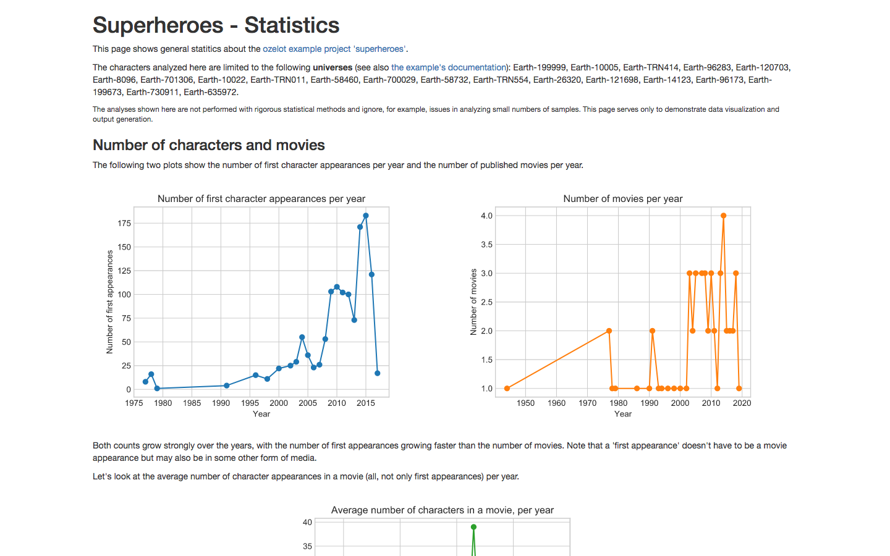
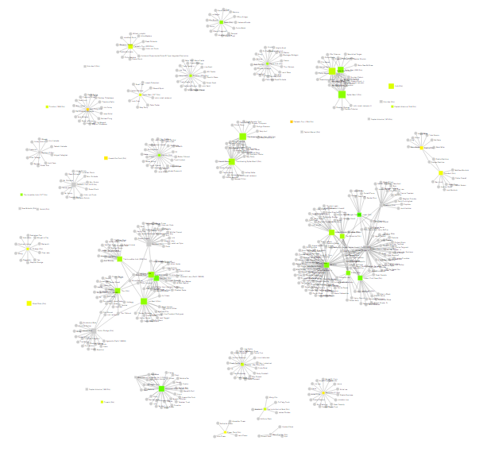
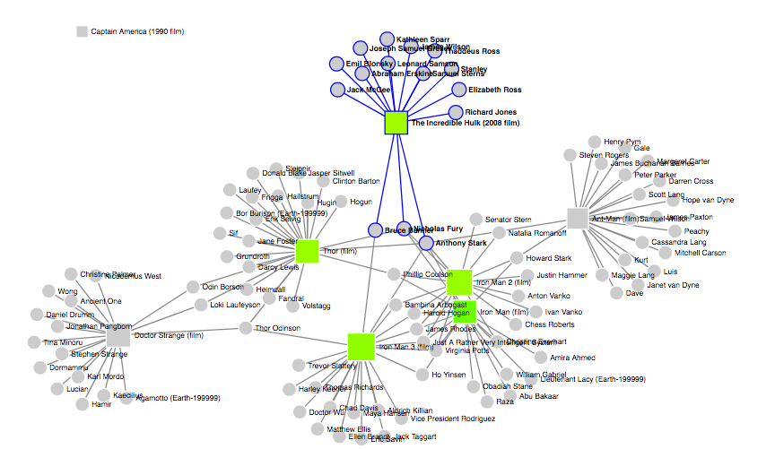

Analysis Output
***************

You have extracted all relevant data, massaged and enriched it and stored it in your database
using a nicely defined schema. Now you can start generating real value, by running your analyses.
(Yes, in the case of this example, one could debate the appropriateness of the term "real value").

All analyses described here are contained in ``analysis.py`` in the example folder.
Once you have your database filled, you can also generate all analysis output by running

.. code-block:: none

    $ python manage.py analyze

.. _sh-overview-table:

Extracting an overview table
============================

One of the common tasks in data integration projects is to dump a selection of the ingested
data to a tabular file, e.g. in CSV or Excel format. Besides making the data usable for others,
this is often valuable for debugging and understanding the data.

In our example, the :func:`superheroes.analysis.character_summary_table` function
generates an overview table for all Characters,
including their Universe, place of birth and number of movie appearances:

.. literalinclude:: ../../../examples/superheroes/superheroes/analysis.py
    :pyobject: character_summary_table

The code is pretty straightforward, with two notable details: (1) the ``outerjoin`` on
the place of birth, see code comments before the ``query`` for details; (2) the separate query for
the number of appearances and the :mod:`pandas` join, avoiding complicated
:mod:`sqlalchemy` queries.

The code writes the data as a
`CSV <../../_static/superheroes/characters.csv>`_ and as an
`Excel <../../_static/superheroes/characters.xlsx>`_ file.

Plots and a static web page
===========================

Next, we might want to generate some summary statistics. Static HTML pages are
a nice way of preparing collections of plots with accompanying explanations, as
they can easily be shared with others.

The function :func:`superheroes.analysis.plots_html_page` generates and explains
some summary statistics about our data. It uses a :mod:`jinja2` template to hold
the formatting and explanatory text. Plots are generated with :mod:`matplotlib`
and :mod:`seaborn` and are injected into the web page as SVG strings.

The actual data queries and analytics are very simple, most of the code handles
plot generation and output formatting. Describing this in detail is beyond the
scope of the tutorial, please study the code (click the function name above
and then the '[source]' link) and refer to the respective package documentations.

The output is written as
`a single html file <../../_static/superheroes/plots_html_page.html>`_.
Below you see a screenshot of (a part of) the page:

Interactive network graph
=========================

Finally, let's show off a bit.
On the web you can find lots of awesome interactive visualization examples that
use ``d3.js`` or other technologies.
By adapting `an example for a zoomable network graph <http://bl.ocks.org/eyaler/10586116>`_
and injecting data from our database, we can quickly generate
`an interactive network graph <../../_static/superheroes/movie_network.html>`_
of characters and movie appearances. Movies (squares) are colored by their rating, with the size
scaled by the inflation-adjusted budget. You can zoom and pan, double-click to center a node,
and shift-click to go the respective wiki page.

(In case you tried to interact and feel rejected: the above are static screenshots,
the interactive plot is
`on a separate page <../../_static/superheroes/movie_network.html>`_.)

The interactive plot is generated by :func:`superheroes.analysis.movie_network`, which injects
JSON-formatted data into a :mod:`jinja2` template containing the JavaScript plotting code.
