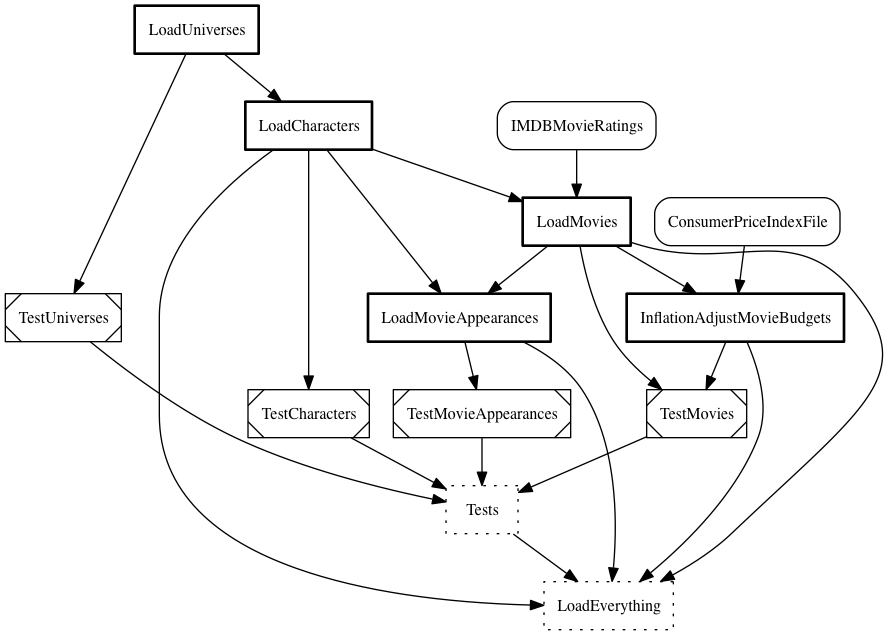

.. _sh-pipeline:

ETL pipeline
************

The module :mod:`superheroes.pipeline` describes the complete ETL pipeline for our project,
i.e. all the data extraction, cleaning, reformatting, linking etc., up to storing everything in the
database using our data model.

This is a diagram of the ETL pipeline, listing the tasks and their relationships.
Each arrow represents a requirement, i.e. the task the array originates from is required
to run before the pointed-to task.

.. _superheroes-pipeline-diagram:

.. py:currentmodule:: superheroes.pipeline

.. _ht-pipeline-diagram-simple:

Different tasks have different styling, based on their base class:

    * :class:`ozelot.etl.tasks.ORMWrapperTask`: dotted outline,
    * :class:`ozelot.etl.tasks.ORMTestTask`: angled corners,
    * other subclasses of :class:`ozelot.etl.tasks.ORMTask`: bold outline,
    * :class:`ozelot.etl.tasks.InputFileTask`: rounded rect,
    * other tasks: simple rect.

:func:`ozelot.etl.util.render_diagram` provides the code for
rendering such a diagram. Diagrams are rendered
'upstream' of a specified task, i.e. all requirements (and their requirements etc.)
of this task are included. The following code renders everything upstream of our wrapper
task :class:`LoadEverything`:

.. code-block:: python

    import pipeline
    from ozelot.etl.util import render_diagram

    render_diagram(root_task=pipeline.LoadEverything(),
                   out_file='/some/output/path/pipeline_diagram.png',
                   format='png')

Note that this requires `GraphViz <http://www.graphviz.org/>`_ to be installed, see also the section about
:ref:`data model diagrams <ht-model-diagram>`.

The diagram above was created by issuing (see also the section :ref:`running`):

.. code-block:: none

    python manage.py diagrams

A brief Luigi primer
====================

.. _ht-luigi-basics:

This is a very brief introduction to pipeline manangement with :mod:`luigi`.
For an in-depth treatment please read the
`luigi documentation <http://luigi.readthedocs.io/>`_.

Tasks
-----

The ETL pipeline is broken down in a series of tasks. Since we use the
:mod:`luigi` package to do pipeline management, each task has to be sub-classed
from :class:`luigi.Task`.

A task is a fairly simple class that usually provides the following methods:

    * :func:`requires`: Returns a list (or a generator)
      of other tasks that need to have run before we can run this task.

    * :func:`output`: Returns a list of targets (see below) that are generated by
      the task.

    * :func:`complete`: Returns ``True`` if the task is complete, ``False`` otherwise.
      Usually, this function is not explicitly defined in your task classes. Instead,
      the default implementation is used, which returns ``True`` if all outputs exist.

    * :func:`run`: The actual work function of the task. Is only run if the task
      is not already complete.

Since each task knows what other tasks it requires, the complete dependency graph
of the ETL pipeline is encoded in the task definitions.

Tasks can have **parameters**, which are instances of :class:`luigi.Parameter` or one of its
subclasses. Luigi checks if required parameters are set when building the pipeline.
Also, two instances of the same task class with different parameters are run as
two distinct task instances.

Targets
-------

Targets represent the output of :mod:`luigi` tasks. A target is a class, that,
as a minimum, provides an :func:`exists` function to check if the respective output
already exists or not.

In the simplest case, a target is a file on disk. In this case, target existence
is equivalent to existence of that file.
The :class:`luigi.LocalTarget` class representes such a
file-based target. Besides that, :mod:`luigi` offers a range of other pre-defined targets, e.g.
for storing task completion in a database.
A task can have many targets, e.g. when creating multiple files in one task.

Tasks list the outputs generate by them, so that task completion
(existence of all outputs) can be checked.
Note that it is up to the :func:`run` function of a task to actually generate
all the targets.

Extensions in ozelot
====================

The :mod:`ozelot` package defines a number of handy task and target extensions
for managing an ETL pipeline that persists its data in a database, via an ORM layer.
These are contained in the modules :mod:`ozelot.etl.tasks` and
:mod:`ozelot.etl.targets`.

.. py:currentmodule:: ozelot.etl

Some features of these extensions are described below, others elsewhere in the
examples. You may want to check out the :ref:`howto` chapter for links.

.. _ht-clear-methods:

Task base and clear() methods
-----------------------------

:class:`tasks.TaskBase` is the base class of all tasks (as you may have guessed).
Its main feature is to encourage you to write a :func:`clear` method. This method,
ideally, un-does all the changes caused by the :func:`run` method of a task.
For some tasks this is as simple as deleting an output file or clearing a
database table. For other tasks this may be more difficult, or even impossible.

If you provide usefult :func:`clear` methods, however, pipeline management becomes
much simpler. For example, you can :ref:`automatically remove <ht-clearing-tasks>`
all output of a specific task *and* of all tasks depending on it.
Also, regularly updating parts of the ETL output
becomes possible, without nuking everything.

In how far this is feasible depends on the specifics of your project,
and it is (unfortunately) up to you to make sure clearing of tasks works as expected.

The ORMTask and ORMTarget classes
---------------------------------

.. _ht-ormtarget-ormtask:

.. py:currentmodule:: ozelot.etl.targets.ORMTarget

Our ETL pipeline writes all its output to a database. We also want task completion
information to be stored in the database. For this we use an
:class:`ozelot.etl.targets.ORMTarget`,
which stores task completion via the :class:`ozelot.orm.target.ORMTargetMarker`
data model. Each instance of a marker carries the task name, a string representation
of task parameters, and a creation time stamp.
:func:`exists` checks existence of a target by querying for a marker entry
with the given task name and parameter string. The functions
:func:`create` and :func:`remove` create and remove marker
entries, respectively, and :func:`from_task` creates a target from a task instance.

.. py:currentmodule:: ozelot.etl.tasks

Most tasks in our pipelines require just one target, telling us if the task is already
complete or not. The :class:`ozelot.etl.tasks.ORMTask` represents such a task.
It has a pre-defined :func:`output` function that returns a single :class:`ORMTarget`.
Two convenience functions, :func:`mark_complete` and :func:`mark_incomplete`
create or remove the target marker, respectively.

The database client
===================

.. _ht-client:

Database connections are managed by :class:`ozelot.client.Client`.
The client wraps an :class:`sqlalchemy.engine.Engine` for communicating with the database
and opening ORM sessions, along with some supporting functionality.
Learn more about `Engines <http://docs.sqlalchemy.org/en/latest/core/engines_connections.html>`_
and `Sessions <http://docs.sqlalchemy.org/en/latest/orm/session.html>`_ in the
:mod:`sqlalchemy` documentation.

When running the pipeline, it is useful to have one client instance that is used
by all tasks. :mod:`ozelot.client` can handle such a singleton client instance for you.
When calling :func:`ozelot.client.get_client` for the first time, a database connection
(with the default configuration defined in your project config) is opened. Any
subsequent call to :func:`get_client` returns the same client instance.

The database configuration is managed via :mod:`ozelot.config`, please see there for details.
Our example provides default project configuration in :mod:`superheroes.project_config`,
which, by default, connects to a (file-based) SQLite database.

:mod:`ozelot` can help you reduce boiler-plate code for managing database connetions in ETL pipelines.
See :ref:`the 'eurominder' example <ht-task-session>` for details.

Loading Universes
=================

.. py:currentmodule:: superheroes.pipeline

The first and simplest task in the pipeline, :class:`LoadUniverses`, loads data about all
'Universes'. This is done by querying the API of the wiki.

.. literalinclude:: ../ozelot-examples/superheroes/superheroes/pipeline.py
    :pyobject: LoadUniverses

.. _ht-ormobjectcreator:

.. py:currentmodule::ozelot.etl.tasks

This task derives from :class:`ozelot.etl.tasks.ORMTask`, but also inherits functionality
from :class:`ozelot.etl.tasks.ORMObjectCreatorMixin`. This mixin can be used for tasks that
are responsible for creating objects of specific types, listed in the
task attribute :attr:`object_classes`.
For such tasks, clearing the task output simply means deleting all objects of the listed
types. This is precisely what :func:`ORMObjectCreatorMixin.clear` does.

With :mod:`ozelot` taking care of most of the infrastructure, there is only
:func:`run` left for you to code.
In it, you set up some infrastructure, query data from the wiki,
build your ORM objects as instances of :class:`superheroes.models.Universe`
and store them in the database. See comments in the code above for more details.

Loading Characters
==================

.. py:currentmodule:: superheroes.pipeline

The next task, :class:`LoadCharacters` looks quite a bit more involved, but in its basic
structure it is very similar to :class:`LoadUniverses`: for each character it queries data from
the wiki, builds a an instance of class :class:`superheroes.models.Character`, and stores it.

.. note::

    To see the complete code of a class from :mod:`ozelot` or an example,
    e.g. of :class:`LoadCharacters`, click the class name to get
    to the API documentation, then follow the ``[source]`` link in the headline.
    This also works for functions and class methods.

We want the loading of Universes to be completed before loading Characters, in order to
set relationships between them (see below). Therefore, :class:`LoadCharacters` lists
:class:`LoadUniverses` as a requirement:

.. literalinclude:: ../ozelot-examples/superheroes/superheroes/pipeline.py
    :pyobject: LoadCharacters.requires
    :dedent: 4

.. note::

    We could also have returned the list ``[LoadUniverses()]`` here. The generator syntax
    using ``yield`` makes the code look a bit nicer. You can add as many ``yield`` statements
    as you need for listing all requirements, see :ref:`load-movies` for an example.

For character data we need two queries. The first one retrieves a list of all character pages:

.. literalinclude:: ../ozelot-examples/superheroes/superheroes/pipeline.py
    :start-after: -- start documentation include: character-list-query
    :end-before: -- end documentation include: character-list-query
    :dedent: 8

.. _ht-requesting-pages:

When iterating over this list, we retrieve the details about each character from
its wiki page (i.e. not via the wiki API):

.. literalinclude:: ../ozelot-examples/superheroes/superheroes/pipeline.py
        :start-after: -- start documentation include: character-page-query
        :end-before: -- end documentation include: character-page-query
        :dedent: 12

.. _ht-lxml-html-parsing:

The resulting :attr:`doc` is an :mod:`lxml.html` document.
The :mod:`lxml` library is a fantastic tool to parse and extract data from
HTML or XML content.
Learn all about it in the `lxml documentation <http://lxml.de/index.html>`_, which
also has a `very helpful tutorial <http://lxml.de/tutorial.html>`_.

.. py:currentmodule:: superheroes.models

Most of :func:`LoadCharacters.run` deals with finding the right HTML tags in the
wiki page, extracting the desired information, converting and cleaning it,
and finally storing it into a :class:`Character` ORM object.
This is not discussed in detail here, please study the code and comments if
you are interested.

For finding the relevant tags in the HTML tag soup, we make heave use
of the ``xpath`` syntax, for which you can `find plenty of information
<https://www.google.com/search?q=xpath>`_ on the web.

.. _ht-creating-orm-references:

However, there is one new concept worth pointing out: Our :class:`Character` class
has relationships to two other ORM object classes, namely :class:`Universe` and
:class:`Place`. When creating characters, we have to define which universe to
reference:

.. literalinclude:: ../ozelot-examples/superheroes/superheroes/pipeline.py
            :start-after: -- start documentation include: universe-object-relation
            :end-before: -- end documentation include: universe-object-relation
            :dedent: 16

For doing this, we query the database for an existing universe with the respective name.
If one is found, we set the foreign key field :attr:`Character.universe_id` to the
:attr:`id` of the universe object. Here, we use the :func:`one` method to query
exactly one object. In case none or multiple results are found, it raises an exception,
which we catch and handle. See the :ref:`queries` chapter for more details
on querying data.

For the place of birth want to reference a :class:`Place` object. However, in contrast
to the Universes, we have not ingested the places beforehand. Instead, we create
new place objects as we go:

.. literalinclude:: ../ozelot-examples/superheroes/superheroes/pipeline.py
                :start-after: -- start documentation include: place-object-relation
                :end-before: -- end documentation include: place-object-relation
                :dedent: 16

.. _load-movies:

Loading Movies
==============

.. py:currentmodule:: superheroes.pipeline

Next, we want to load data about movies in :class:`LoadMovies`. This task
requires Characters to have been loaded and additionally needs an input file
containing movie ratings:

.. literalinclude:: ../ozelot-examples/superheroes/superheroes/pipeline.py
    :pyobject: LoadMovies.requires
    :dedent: 4

.. _ht-static-input-file:

A static input file
-------------------

The input file containing the movie ratings is represented by the task
:class:`IMDBMovieRatings`:

.. literalinclude:: ../ozelot-examples/superheroes/superheroes/pipeline.py
    :pyobject: IMDBMovieRatings

This is a static input file, the pipeline never changes it. We can represent it by a task
with an empty :func:`run` method, listing the required file as a target in its
:func:`output`. This way, :mod:`luigi` will check the existence of the file when
running the pipeline and complain if it is missing. (The task is complete if all outputs
are present, and if an output is missing and the task cannot create it, the task never
completes.)

To do this, we derive our task from :class:`ozelot.etl.tasks.InputFileTask`.
It pre-defines empty :func:`run` and :func:`clear` methods
(we never want to delete the input file), and an :func:`output` method that lists
one :class:`luigi.LocalTarget`, pointing to the file given as class attribute
:attr:`input_file`. It also encourages you to write a :func:`load` method to
read the file. This way, you can keep loading logic with the input file definition.

For :class:`IMDBMovieRatings` we generate the :attr:`input_file` path on the fly,
so we need to define it as a ``property``.

Actually loading movies
-----------------------

The rest of :class:`LoadMovies` is similar to the tasks seen before: setting up some
infrastructure; querying wiki pages; extracting relevant information; building
ORM objects; and storing everything to the database. Study the code to find out
all the details.

Loading Movie Appearances
=========================

.. py:currentmodule:: superheroes.pipeline

Now we want to link Characters to Movies, by storing data about movie appearances of
characters. This happens in :class:`LoadMovieAppearances`.

You should easily recognize the overall task structure by now.
The extraction of relevant information from the wiki pages is a bit tricky,
because we want to know the type of appearance (featured character, supporting character, ...)
for each character. This is encoded in ``h2`` headings, and extracting those together
with the respective appearances is somewhat difficult. You can read the comments in
the :func:`LoadMovieAppearances.run` code for details.

Two other details are worth pointing out: Firstly, we wrap the object generation in a

.. code-block:: python

    with session.no_autoflush:

block. Without it, :mod:`sqlalchemy` would flush our session (commit all
changes, like newly added objects, to the database) before running a query. This
behaviour causes issues with the :attr:`id` fields of newly generated objects here,
and we don't need the auto-flushing anyway.

.. _ht-many-to-many-generation:

Secondly, here is how we generate the association objects for the many-to-many relationship:

.. literalinclude:: ../ozelot-examples/superheroes/superheroes/pipeline.py
                :start-after: -- start documentation include: many-to-many-generation
                :end-before: -- end documentation include: many-to-many-generation
                :dedent: 36

The noteworthy point is that there is nothing special to see -- an association object
is created just like any other ORM object instance, just with two foreign key references.

Inflation adjustment
====================

.. py:currentmodule:: superheroes.pipeline

We're almost done. The final task is to compute inflation-adjusted values for
movie budgets, in :class:`InflationAdjustMovieBudgets`. This requires a static
input file :class:`ConsumerPriceIndexFile`, which comes with a handy loading method
that returns the data as a :class:`pandas.DataFrame`.

In contrast to the tasks seen before, :class:`InflationAdjustMovieBudgets` does *not*
generate a class of ORM objects (and, therefore, does not inherit from
:class:`ozelot.etl.tasks.ORMObjectCreatorMixin`).
This means that we have to write our own :func:`clear` method:

.. _ht-custom-clear:

.. literalinclude:: ../ozelot-examples/superheroes/superheroes/pipeline.py
    :pyobject: InflationAdjustMovieBudgets.clear
    :dedent: 4

.. py:currentmodule:: superheroes.models

The task's job is to take the :attr:`Movie.budget` value of each movie and
compute the inflation-adjusted :attr:`Movie.budget_inflation_adjusted`.
Therefore, clearing the task means deleting all
:attr:`Movie.budget_inflation_adjusted` values, by setting them to ``None``.
:mod:`sqlalchemy` offers a convenient bulk :func:`update` method to do this in one go.

.. _ht-consistency-checks:

Consistency checks
==================

.. py:currentmodule:: superheroes.pipeline

How do you know if your data import was successful? It is useful, of course, to write
unit tests for your pipeline tasks, using constant test data (although we don't do that here).
However, if you get 'new' data in each import, it's impossible to test all of it against
'ground truth'. Instead, this example uses a number of test tasks that assess
the plausibility and consistency of the imported data.
These are the tasks named ``Test...`` in the :ref:`pipeline diagram <superheroes-pipeline-diagram>`,
with a wrapper task :class:`Tests`.

As an example, :class:`LoadUniverses` is tested by :class:`TestUniverses`:

.. literalinclude:: ../ozelot-examples/superheroes/superheroes/pipeline.py
    :pyobject: TestUniverses

This task does no actual data ingestion. It queries various subsets of data and
compares the results to expected values, using ``assert`` statements.
The other test tasks, :class:`TestCharacters`, :class:`TestMovies` and
:class:`TestMovieAppearances` are very similar in their idea and structure.

There are various smarter ways of implementing such functionality.
For example, the `Test-Driven Data Analysis (TDDA) <http://pythonhosted.org/tdda/>`_ library
contains nice functionality for developing and implementing unit tests and consistency checks
for data ingestion and analytics.

Wrapping it all up
==================

.. py:currentmodule:: superheroes.pipeline

.. _ht-wrapper-task:

Finally, we define a wrapper task :class:`LoadEverything` that requires all of the
pipeline tasks, so that we can launch a build of the whole pipeline at once.
We don't need to list every single task of the pipeline, because the requirements of the
listed tasks will be built, too. (Which tasks to include is a matter of taste, just make
sure everything you want built is included as a requirement somewhere.)

.. literalinclude:: ../ozelot-examples/superheroes/superheroes/pipeline.py
    :pyobject: LoadEverything

This task doesn't do any work, it is complete once all requirements are complete.
It inherits this behaviour from :class:`ozelot.etl.tasks.ORMWrapperTask`:
the :func:`run` method does nothing apart from marking the task as complete,
the :func:`clear` method marks the task as incomplete.

